# README - PPS Unidad 0 Actividad 3

## Índice

- [README - PPS Unidad 0 Actividad 3](#readme---pps-unidad-0-actividad-3)
  - [Índice](#índice)
  - [Introducción](#introducción)
  - [Creación de repositorio](#creación-de-repositorio)
  - [Visualizando la página web](#visualizando-la-página-web)
  - [Colaborando en el Proyecto](#colaborando-en-el-proyecto)
  - [Erre que erre con Git Logs](#erre-que-erre-con-git-logs)

---

## Introducción
En esta tercera y última práctica de Git, nos adentraremos en el trabajo colaborativo usando la plataforma GitHub. La actividad consiste en la creación de un repositorio compartido que permita visualizar perfiles de usuario en un proyecto en PHP. El objetivo es gestionar un proyecto donde cada colaborador pueda añadir su propia foto y una descripción en una página de perfil. Además, se espera que el repositorio contenga una documentación detallada de todo el proceso en formato Markdown (``README.md``), así como los archivos necesarios, incluyendo imágenes y otros documentos de soporte.

## Creación de repositorio 

En esta sección crearemos un repositorio en GitHub que contenga un proyecto en PHP para visualizar la información de diferentes usuarios, incluyendo una foto y una descripción. Primero debemos crear el repositorio desde la plataforma de Github, ya visto en prácticas anteriores, para despues ir documentando todo en el README.md.

Haremos uso de comandos básicos como:
   ```bash
echo "# PPS-Unidad0Actividad5-TuNombre" >> README.md
git init
git add README.md
git commit -m "first commit"
git branch -M main
git remote add origin git@github.com:TuUsuarioGitHub/PPSUnidad0Actividad5TuNombre.git
git push -u origin main
   ```
o comandos como ```git remote -v``` para verificar que el repositorio remoto esté correctamente configurado.

Una vez creado el repositorio debemos crear la distribución del mismo. Dentro de la carpeta del proyecto, se debe organizar y crear los archivos necesarios para el proyecto PHP. El objetivo es crear una página donde se visualice información de diferentes usuarios, incluyendo una foto de cada usuario y una descripción breve de cada usuario:

   ```graphql
PPS-ActividadUnidad0-TuNombre/
├── images/                  # Carpeta para las fotos de los usuarios
├── index.php                # Archivo principal en PHP para visualizar usuarios
├── README.md                # Documentación del proyecto
└── profile/                 # Carpeta nuestra página de perfil personalizada
   ```


## Visualizando la página web
En esta sección, vamos a lanzar un servidor web local utilizando PHP para visualizar el contenido de nuestra página web. Además, añadiremos una imagen de perfil y crearemos una página individual que permita visualizar nuestro perfil personal.

*1*. **Iniciar el Servidor PHP**
Para comenzar, lanzaremos un servidor PHP desde la terminal para que podamos visualizar nuestra página web en un navegador, con el siguiente comando:
   ```bash
   php -S 0.0.0.0:8080
   ```
Esto iniciará un servidor en el puerto 8080. Podremos acceder a la página web desde el navegador en la siguiente dirección:

   ```plaintext
   http://localhost:8080
   ```

> **Nota**: Mantendremos la terminal abierta mientras el servidor esté activo. Si queremos detener el servidor en algún momento, simplemente presionaremos ``CTRL + C`` en la terminal.

*2*. **Añadir una Imagen de Perfil**
Ahora vamos a personalizar la página web añadiendo una imagen de perfil. Colocaremos una foto o avatar en la carpeta ``img`` dentro de nuestro proyecto. El archivo de imagen debe llevar nuestro nombre como nombre de archivo, sin espacios y con una extensión compatible (por ejemplo, ``nombre.jpg`` o ``nombre.png``):
   ```plaintext
   img/Cristian.png
   ```
> **Nota**: Asegurémonos de que la imagen tenga un tamaño adecuado para una visualización en web, optimizando si es posible.

*3*. **Crear una Página de Perfil en HTML**
A continuación, crearemos un archivo HTML en la carpeta profile con el mismo nombre que el de nuestra imagen de perfil. Este archivo HTML servirá como nuestra página de perfil personalizada.
   - Primero, navegamos a la carpeta profile y creamos el archivo HTML. Por ejemplo:

      ```bash
      touch profile/Cristian.html
      ```

   - Luego, editaremos este archivo HTML para incluir nuestra imagen de perfil y una breve descripción. Podemos usar un editor de texto para agregar el siguiente contenido:

      ```html
      <!DOCTYPE html>
      <html lang="es">
      <head>
         <meta charset="UTF-8">
         <meta name="viewport" content="width=device-width, initial-scale=1.0">
         <title>Perfil de Cristian</title>
      </head>
      <body>
         <h1>Bienvenido a mi perfil</h1>
         
         <p>Hola, soy Cristian. Esta es mi página de perfil donde puedes conocer un poco más sobre mí.</p>
      </body>
      </html>
      ```
En este código, nos aseguramos de que la ruta de la imagen esté correctamente referenciada (``../img/Nombre.png``).

<p align="center">
  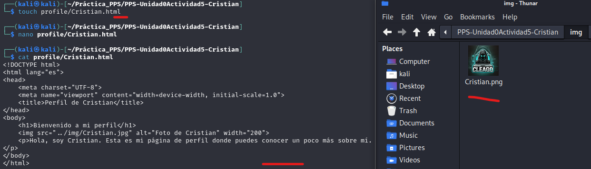
</p>
<p align="center"><em>Imagen 1: Creación de perfil y logo</em></p>


*4*. **Diseñar página principal**
A continuación, crearemos la página principal que hará de enlace hacia los perfiles creados, en la carpeta `profile`. El archivo se llamará `index.html` y tendrá un código como este:

   ```html
<!DOCTYPE html>
<html lang="es">
<head>
    <meta charset="UTF-8">
    <meta name="viewport" content="width=device-width, initial-scale=1.0">
    <title>Lista de Perfiles de Usuarios</title>
</head>
<body>
    <h1>Bienvenidos a la Página de Perfiles</h1>
    <p>A continuación, encontrarás una lista de usuarios y sus perfiles.</p>

    <div class="usuarios">
        <!-- Perfil de Cristian -->
        <div class="usuario">
            <h2><a href="profile/Cristian.html">Cristian</a></h2>
            <a href="profile/Cristian.html">
                
            </a>
            <p>Hola, soy Cristian. Haz clic en mi nombre o en mi foto para ver mi perfil completo.</p>
        </div>

        <!-- Puedes añadir más perfiles de otros usuarios aquí -->
    </div>
</body>
</html>
   ```

*4*. **Visualizar página**
Una vez que hayamos configurado la imagen y creado la página de perfil, volvemos al navegador y refrescamos la página (o accedemos nuevamente a ``http://localhost:8080``). Revisaremos el contenido para verificar que la imagen de perfil y la página HTML personalizada se muestren correctamente. Si todo está bien configurado, deberíamos ver nuestra página de perfil personalizada con la foto que añadimos y el texto que describimos.

Con estos pasos, hemos lanzado el servidor local, añadido una imagen personalizada, y creado una página de perfil HTML. Esto nos permite visualizar el contenido de nuestra página web en un entorno de desarrollo local y comprobar cómo se actualizan los cambios en tiempo real.

<p align="center">
  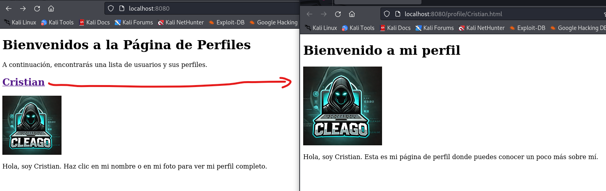
</p>
<p align="center"><em>Imagen 2: Visualización de la página con mi perfil solamente</em></p>

## Colaborando en el Proyecto
En esta fase, vamos a colaborar activamente en los repositorios de nuestros compañeros y les permitiremos colaborar en el nuestro. Utilizaremos varias funciones de Git y GitHub para gestionar esta colaboración de forma ordenada y eficiente.

*1*. **Añadir colaboradores a nuestro proyecto**
Para que nuestros compañeros puedan colaborar en nuestro proyecto, primero debemos añadirlos como colaboradores en nuestro repositorio en GitHub. Esto se realiza desde la Configuración del Repositorio, en la sección de Collaborators.
   - Vamos a **Settings** > **Collaborators** y añadimos los nombres de usuario de al menos dos compañeros. 
   - Nuestros compañeros recibirán una invitación para colaborar en el proyecto. Una vez que acepten la invitación, podrán realizar cambios en el repositorio.

<p align="center">
  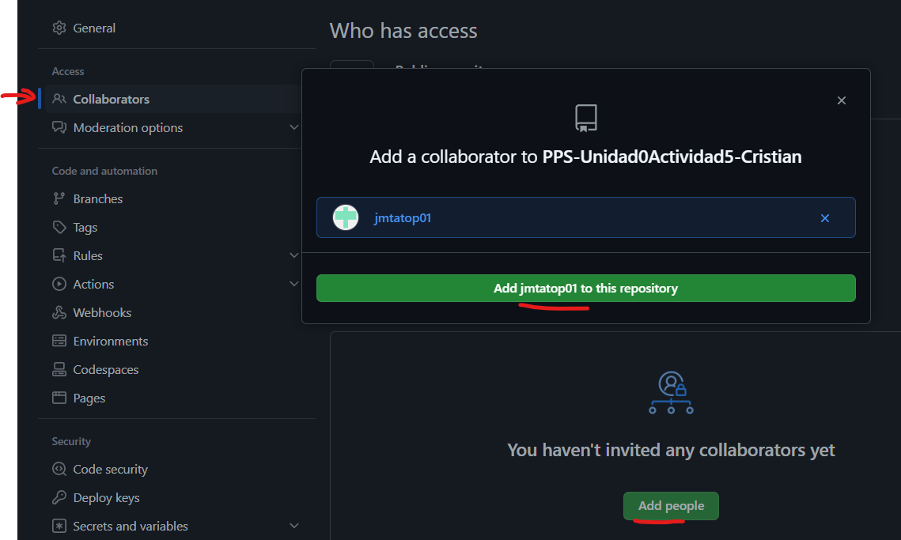
</p>
<p align="center"><em>Imagen 3: Añadir colaboradores</em></p>

*2*. **Creación de una rama de trabajo nuestra**
Para simular como se realizaría un trabajo con más programadores, vamos a colaborar en los proyectos de nuestros compañeros. Repetimos los siguientes pasos para cada repositorio al que nos hayan invitado, primero creando una rama en la que "trabajaríamos" nosotros.

   - Aceptamos la Invitación: Nos dirigimos a nuestro correo o a la sección de notificaciones de GitHub para aceptar la invitación de colaboración en el repositorio del compañero.
   - Clonamos el Repositorio: Una vez aceptada la invitación, clonamos el repositorio en nuestro equipo. Para evitar conflictos, creamos una nueva carpeta específica para este proyecto.
   - Para evitar interferir en el trabajo de nuestro compañero, vamos a trabajar en una nueva rama con nuestro nombre:
      ```bash
      # Crea una rama con mi nombre
      git branch Cristian

      # Cambiar a mi rama
      git checkout Cristian

      # Verificar nuestra rama
      git status -s
      ```
   - Antes de realizar cambios, verificamos los remotos configurados para asegurarnos de que estamos conectados al repositorio correcto, con `git remote -v`.
   - Actualizamos la nueva rama.

<p align="center">
  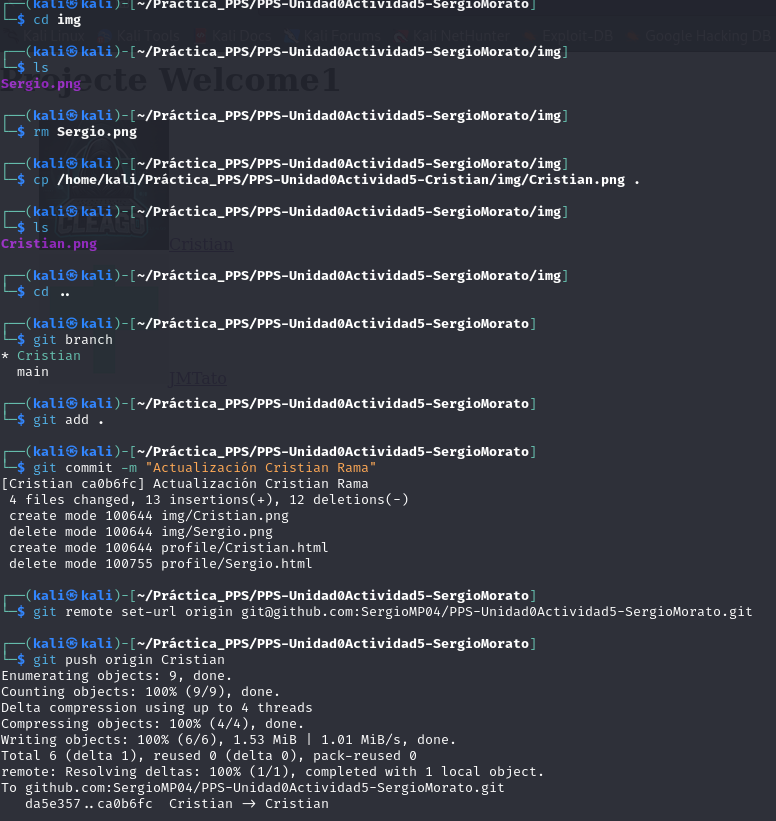
</p>
<p align="center"><em>Imagen 4: Incluir archivo en la rama creada local del repositorio del compañero</em></p>

Una vez hemos copiado los archivos nuestros en esta rama, borramos los del compañero para quedar solo nuestro perfil. Luego, los añadimos en la rama principal y quedamos ambos perfiles.
<p align="center">
  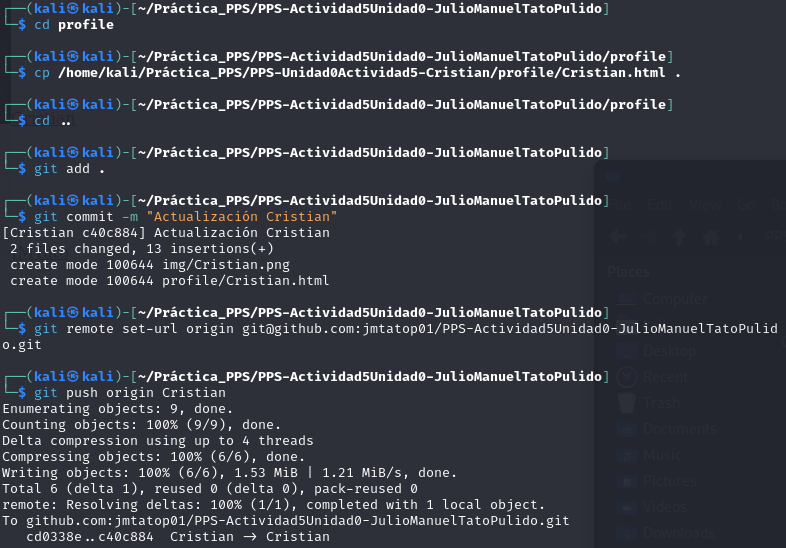
</p>
<p align="center"><em>Imagen 5: Actualizar rama en local</em></p>

Por último, actualizamos la rama main del repositorio con `git push origin main`.

<p align="center">
  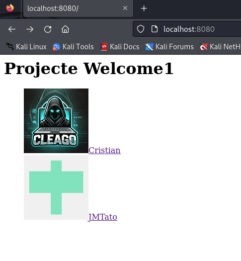
</p>
<p align="center"><em>Imagen 6: Página de un compañero</em></p>


Haremos lo mismo con otro compañero más.

## Erre que erre con Git Logs
En esta sección, repasaremos el comando git log y exploraremos las diferentes opciones que nos ofrece para visualizar el historial de confirmaciones (commits) en nuestro proyecto. Este comando es fundamental para revisar los cambios realizados en el repositorio y comprender el historial de modificaciones.

*1.* **Mostrar el Historial Completo de Confirmaciones**
Para ver el historial completo de confirmaciones, utiliza el comando básico:
   ```bash
git log
   ```
Esto mostrará una lista de todos los commits, junto con su hash, autor, fecha y mensaje de commit.

<p align="center">
  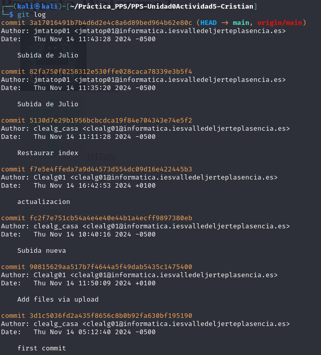
</p>
<p align="center"><em>Imagen 7: Historial de confirmaciones</em></p>

*2.* **Mostrar los Logs de los Últimos 3 Commits**
Para limitar la visualización a los últimos 3 commits, utiliza la opción -n, donde n es el número de commits que quieres ver:
   ```bash
git log -3
   ```

<p align="center">
  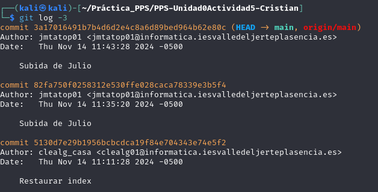
</p>
<p align="center"><em>Imagen 8: Mostrar los últimos 3 logs</em></p>

*3.* **Mostrar los Logs Utilizando el Modificador `--pretty`**
El modificador ``--pretty`` permite personalizar el formato de salida del ``git log``. Puedes usar otros formatos predefinidos o personalizados, como:
- oneline: muestra cada commit en una sola línea.
- short: muestra un formato reducido.
- full: muestra el formato completo con todos los detalles

   ```bash
   git log --pretty=oneline
   ```

<p align="center">
  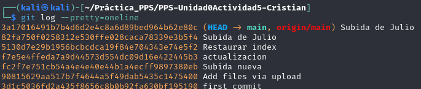
</p>
<p align="center"><em>Imagen 9: Ejemplo del uso del modificador pretty para mostrar logs</em></p>

*4.* **Mostrar los Logs de los Últimos 2 Commits con las Diferencias**
Para ver los detalles de los últimos 2 commits, incluyendo las diferencias en los archivos modificados (``diff``), utiliza ``-p`` junto con el límite de commits ``-2``:
   ```bash
   git log -p -2
   ```
Esto mostrará los últimos 2 commits (por ``-2``) y sus diferencias de código (por ``-p``), permitiéndote ver los cambios específicos en cada uno.

<p align="center">
  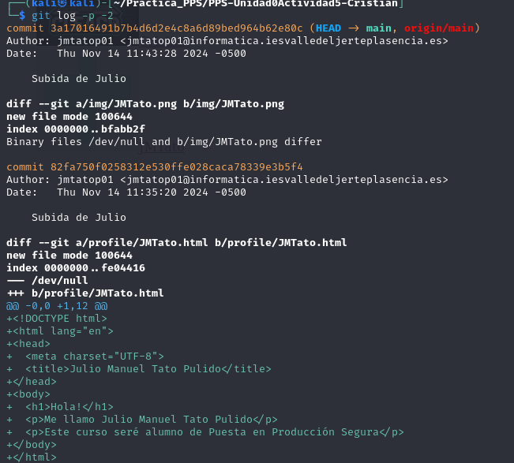
</p>
<p align="center"><em>Imagen 10: Mostrar los últimos 2 logs incluyendo las diferencias en los archivos modificados</em></p>

*5.* **Mostrar los Logs de las Modificaciones Realizadas en el Último Día**
Para ver los commits realizados en las últimas 24 horas, puedes usar el modificador ``--since``. Este comando muestra los commits realizados desde una fecha específica:
   ```bash
   git log --since="1 day ago"
   ```
Esto listará todos los commits que se hayan hecho en el último día. Puedes cambiar ``1 day ago`` por ``2 days ago``, ``1 week ago``, o fechas específicas si necesitas más flexibilidad.

<p align="center">
  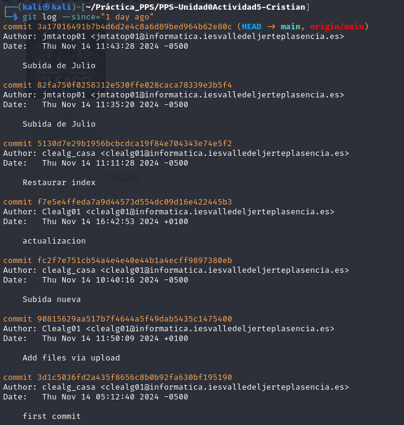
</p>
<p align="center"><em>Imagen 11: Mostrar los commits realizados en las últimas 24 horas</em></p>